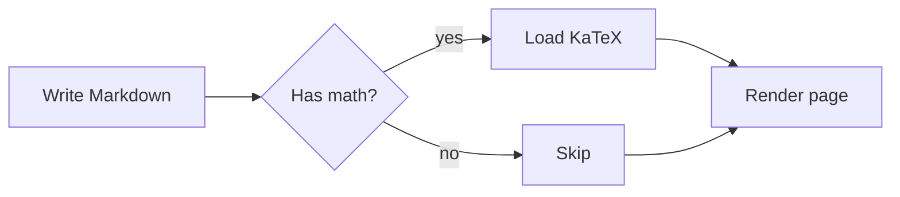
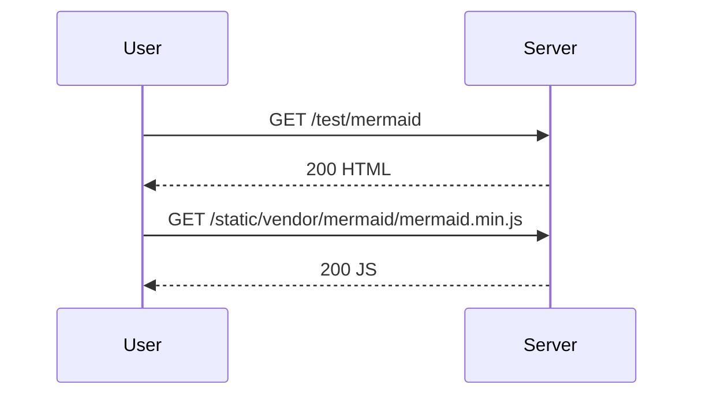
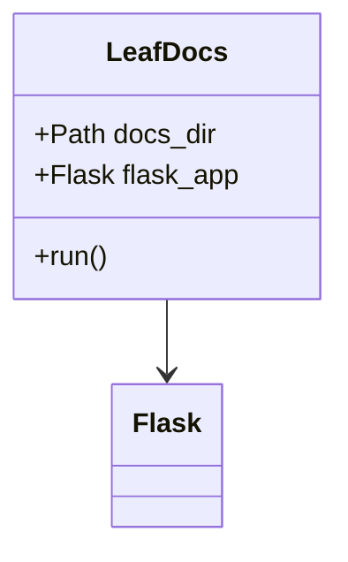

## Flowchart


```mermaid
flowchart LR
    A[Write Markdown] --> B{Has math?}
    B -- yes --> C[Load KaTeX]
    B -- no --> D[Skip]
    C --> E[Render page]
    D --> E
```

## Sequence


```mermaid
sequenceDiagram
    participant U as User
    participant S as Server
    U->>S: GET /test/mermaid
    S-->>U: 200 HTML
    U->>S: GET /static/vendor/mermaid/mermaid.min.js
    S-->>U: 200 JS
```

## Class


```mermaid
classDiagram
    class LeafDocs {
        +Path docs_dir
        +Flask flask_app
        +run()
    }
    class Flask
    LeafDocs --> Flask
```

## Coexistence

Inline math on the same page: \(n \log n\).

```python
def render(doc):
    return markdown(doc.content)
```
